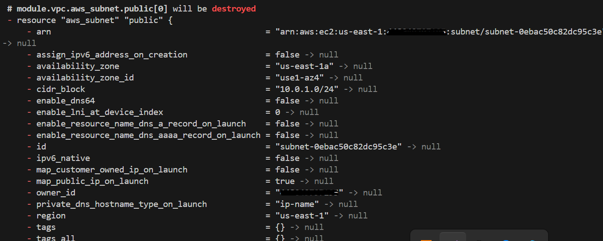
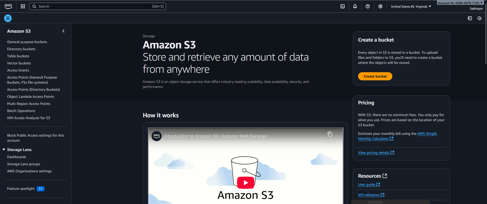
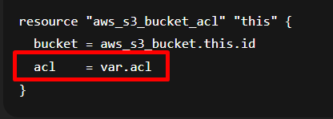

# Terraform VPC and S3 Project

This project demonstrates how to use Terraform modules to create:
- A custom VPC with public and private subnets
- An S3 bucket for storage
- Terraform remote backend configuration using S3

## Project Structure
terraform-modules-vpc-s3/
├── backend.tf
├── main.tf
├── modules/
│ ├── vpc/
│ │ └── main.tf
│ └── s3/
│ └── main.tf
└── README.md

## CLI Installation and Authentication  


## Steps

1. Initialize Terraform:
```bash
terraform init
```
2. Validate:
```
terraform validate
```
3. Plan
```
terraform plan
```
4. Apply:
```
terraform apply
```


# Instructions

## Step 1: Create Project Directory
```bash
mkdir terraform-modules-vpc-s3
cd terraform-modules-vpc-s3
```

## Step 2: Create Module Directories
```bash
mkdir -p modules/vpc
mkdir -p modules/s3
```

## Step 3: Write the VPC Module Configuration
```bash
nano modules/vpc/main.tf
```

## Step 4: Write the S3 Module Configuration
```bash
nano modules/s3/main.tf
```

## Step 5: Create the Main Terraform Configuration File
```bash
nano main.tf
```

### Example `main.tf`
```hcl
provider "aws" {
  region = "us-east-1" # Change this to your desired AWS region
  profile = "default" 
}

module "vpc" {
  source              = "./modules/vpc"
  vpc_cidr            = "10.0.0.0/16"
  public_subnet_cidrs = ["10.0.1.0/24"]
  private_subnet_cidrs = ["10.0.2.0/24"]
}

module "s3_bucket" {
  source      = "./modules/s3"
  bucket_name = "my-terraform-state-bucket-account-ID"
 
}

```

## Step 6: Create the Backend Configuration File
```bash
nano backend.tf
```

### Example `backend.tf`
```hcl
terraform {
  backend "s3" {
    bucket         = "my-terraform-state-bucket-account-ID"
    key            = "terraform.tfstate"
    region         = "us-east-1"
    encrypt        = true
    use_lockfile   = true
  }
}

```

## Step 7: Initialize the Project
```bash
terraform init
```

## Step 8: Apply the Configuration
```bash
terraform apply
```

---

## Cleanup
At the end of the project, run __terraform destroy__ to cleanup and avoid unncessary AWS charges. 
 





## Challenges  
1. Deprecated parameter  
i. AWS provider v5 deprecated the acl argument in aws_s3_bucket.

```
resource "aws_s3_bucket_acl" "this" {
  bucket = aws_s3_bucket.this.id
  acl    = var.acl
}
  ```  

**How to fix**  
If you don’t need special ACLs, just remove the acl line from your aws_s3_bucket resource:  
```
resource "aws_s3_bucket" "this" {
  bucket = var.bucket_name
}

```
ii. dynamodb_table is deprecated  
Terraform’s AWS backend changed recently. Instead of dynamodb_table, you now use use_lockfile = true.  


**How to fix**  
Update your backend.tf like this:
```
terraform {
  backend "s3" {
    bucket        = "your-terraform-state-bucket"
    key           = "terraform.tfstate"
    region        = "us-east-1" # change to your region
    encrypt       = true
    use_lockfile  = true
  }
}

```
2. Workspace error


Terraform is trying to access your S3 backend bucket in eu-north-1, but the bucket actually exists in us-east-1.  

**How to fix**  
Find your bucket actual region  
```
aws s3api get-bucket-location --bucket your-terraform-state-bucket

``` 
If it’s "None", that means us-east-1. Otherwise, it will return the real region.
Update your backend.tf to use the same region:
```
terraform {
  backend "s3" {
    bucket        = "your-terraform-state-bucket"
    key           = "terraform.tfstate"
    region        = "us-east-1"   # must match exactly!
    encrypt       = true
    use_lockfile  = true
  }
}

```

3. Unable to access object  
```
Error: Error refreshing state: Unable to access object "terraform.tfstate" in S3 bucket "your-terraform-state-bucket": operation error S3: HeadObject, https response error StatusCode: 403, RequestID: RV02K9DE6GHWJWMN, HostID: mzGyiL6Rf7xFl1rn2+L73t5CxWy9R609DA5oLR8t67jMNvR0VxLq8ttVcIa9lnptAhhkTwu8H3E=, api error Forbidden: Forbidden
```
S3 permissions issue (403 Forbidden). That means Terraform can reach the bucket, but your IAM user/role doesn’t have the right permissions to read/write the state file.  
**How to fix**  
For storing Terraform state in S3 and optionally using DynamoDB for state locking, attach these policies to your IAM user/role:  
```
AmazonS3FullAccess
AmazonDynamoDBFullAccess
```
Please note that Terraform cannot create the S3 bucket that it uses as its backend — the backend bucket must already exist before you run terraform init. That’s why you’re getting 403 Forbidden: Terraform is looking for terraform.tfstate in a bucket that isn’t there yet.  
Create the bucket manually. Run this once from the CLI:
```
aws s3api create-bucket \
  --bucket your-terraform-state-bucket \
  --region us-east-1 \
  --create-bucket-configuration LocationConstraint=us-east-1
```
Note: If you are creating a bucket in us-east-1, you must NOT pass a --create-bucket-configuration.

For all other regions, you must include --create-bucket-configuration LocationConstraint=<region>.
```
aws s3api create-bucket \
  --bucket your-terraform-state-bucket \
  --region us-east-1

```
